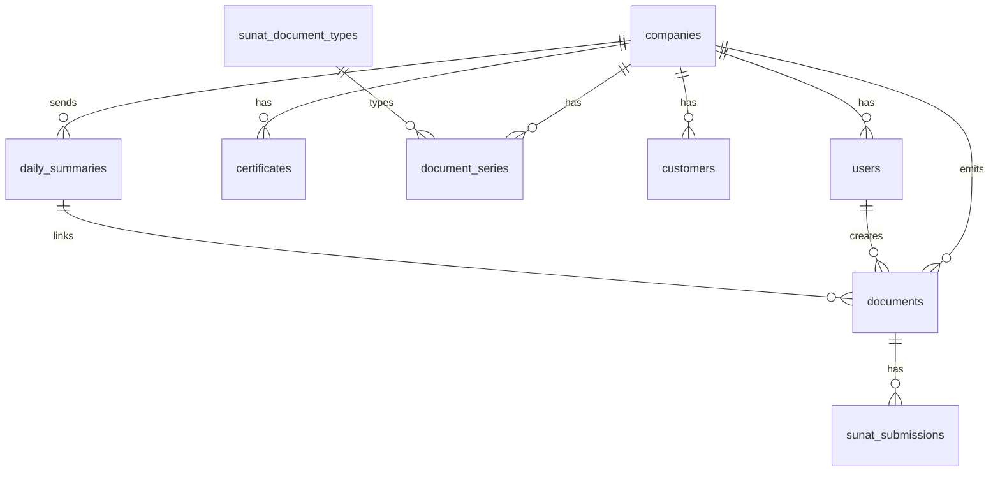

# Base de datos — mind-billing-api

Referencia del esquema PostgreSQL para agentes y desarrollo. Copia canónica en proyecto: [docs/DATABASE.md](../../../docs/DATABASE.md).

---

## Resumen

- **Motor:** PostgreSQL con extensión `pgcrypto`
- **Modelo:** multi-tenant por `companies.api_key`
- **10 tablas:** catálogo, tenant, usuarios, series, clientes, certificados, documentos, resúmenes SUNAT, submissions
- **Migraciones:** `src/database/migrations/` (4 archivos, Sprint 1–3)
- **Setup:** `npm run db:setup`

---

## Diagrama ER



---

## Tablas por dominio

| Dominio | Tablas |
|---------|--------|
| Catálogo SUNAT | `sunat_document_types` |
| Multi-tenant | `companies`, `users` |
| Config emisor | `certificates`, `document_series` |
| Maestros | `customers` |
| Comprobantes | `documents`, `sunat_submissions` |
| Resúmenes async | `daily_summaries` |

---

## `companies` — tenant

Resuelto en cada request vía header `X-Api-Key`.

| Columna clave | Descripción |
|---------------|-------------|
| `ruc` | Emisor SUNAT |
| `api_key` | Identificador tenant (UK) |
| `sunat_environment` | `beta` \| `homologacion` \| `production` |
| `sol_username` / `sol_password` | Credenciales SOAP; beta default `{ruc}MODDATOS` / `MODDATOS` |

**Dev:** id `00000000-0000-4000-8000-000000000001`, api_key `mbak_dev00000000000000000000000001`.

---

## `documents` — comprobantes

| Columna clave | Descripción |
|---------------|-------------|
| `doc_type` | `01` factura, `03` boleta, `07` NC, `08` ND |
| `serie` + `correlativo` | UK con `company_id` y `doc_type` |
| `status` | Ver tabla estados abajo |
| `issue_date` | Fecha emisión; filtro RC |
| `daily_summary_id` | RC/RA que informó o está procesando el doc |
| `payload` | jsonb: cliente, items, totals, documentoAfectado, `_rcVoid` |
| `xml_content` | UBL firmado |

### Estados `documents.status`

| Estado | Tipos | Significado |
|--------|-------|-------------|
| `signed` | 03, 07, 08 | Firmado, pendiente RC |
| `accepted` | todos | CDR OK |
| `voided` | 03, 01 | RC void o RA |
| `submitted` | 01, 07, 08 | Transitorio sendBill |
| `rejected` / `failed` | todos | Error SUNAT o técnico |
| `draft` | 07, 08 | Transitorio NC factura |

### `payload` jsonb — campos importantes

```typescript
{
  cliente: { tipoDoc, numDoc, razonSocial },
  moneda: "PEN",
  items: [...],
  totals: { subtotal, igvTotal, total },
  documentoAfectado: { docType, serie, correlativo },  // notas
  _rcVoid: { voidSummaryId, originalDailySummaryId }   // void en curso
}
```

---

## `daily_summaries` — RC y RA

Misma tabla para ambos tipos SUNAT async.

| Columna clave | Descripción |
|---------------|-------------|
| `summary_type` | `RC` (SummaryDocuments) \| `RA` (VoidedDocuments) |
| `summary_code` | `RC-20260524-1` o `RA-20260524-1` (UK por company) |
| `reference_date` | Emisión de docs en líneas |
| `issue_date` | Fecha envío resumen |
| `correlativo` | Secuencia por company + type + issue_date |
| `ticket` | De sendSummary; clave para getStatus |
| `status` | draft → submitted → processing → accepted/rejected/failed |
| `cdr_xml` | CDR del resumen |
| `xml_content` | XML enviado |

### RC vs RA en BD

| | RC | RA |
|---|----|----|
| `summary_type` | `RC` | `RA` |
| Docs en `documents.daily_summary_id` | 03, 07, 08 | 01 |
| Entrada doc | `signed` (altas) o `accepted` (void) | `accepted` |
| Salida doc | `accepted` o `voided` | `voided` |

---

## `document_series` — correlativos

UK: `(company_id, doc_type, serie)`. Lock pessimista al incrementar.

| Dev | doc_type | serie |
|-----|----------|-------|
| Factura | `01` | `F001` |
| Boleta | `03` | `B001` |
| NC factura/boleta | `07` | `FC01` / `BC01` |
| ND factura/boleta | `08` | `FD01` / `BD01` |

---

## `sunat_submissions`

Solo envíos **sendBill** (facturas, NC/ND factura). RC/RA guardan CDR en `daily_summaries`.

| Columna | Uso |
|---------|-----|
| `method` | `sendBill` |
| `status_code` | Del CDR |
| `cdr_xml` | Respuesta SUNAT |
| `error_message` | Si falló |

---

## Otras tablas

| Tabla | Propósito |
|-------|-----------|
| `users` | Login JWT; UK `(company_id, username)` |
| `certificates` | .pfx por empresa; `pfx_path`, `pfx_password` |
| `customers` | Catálogo clientes; UK `(company_id, doc_type, doc_number)` |
| `sunat_document_types` | Catálogo global tipos comprobante |

---

## Índices relevantes para queries de negocio

| Índice | Uso |
|--------|-----|
| `IDX_documents_pending_rc` | Boletas `signed` sin RC |
| `IDX_daily_summaries_company_type_issue` | Correlativo RA/RC por día |
| `UQ_documents_company_doc_serie_correlativo` | Unicidad comprobante |
| `UQ_daily_summaries_code` | Unicidad código resumen |

---

## Consultas frecuentes (SUNAT)

```sql
-- Pendientes RC
SELECT * FROM documents
WHERE company_id = $1 AND status = 'signed'
  AND daily_summary_id IS NULL AND issue_date = $2;

-- Boletas void
SELECT * FROM documents
WHERE company_id = $1 AND doc_type = '03'
  AND status = 'accepted' AND daily_summary_id IS NOT NULL;

-- Facturas RA
SELECT * FROM documents
WHERE company_id = $1 AND doc_type = '01'
  AND status = 'accepted' AND daily_summary_id IS NULL;

-- Polling RC/RA
SELECT * FROM daily_summaries
WHERE id = $1 AND ticket IS NOT NULL;
```

---

## Migraciones (orden)

1. `InitialSchema` — schema base
2. `Sprint2Closure` — error_message submissions, unique documents
3. `Sprint3BoletasRc` — daily_summaries + issue_date + daily_summary_id
4. `Sprint3NotesRa` — summary_type RC/RA

---

## Relación BD ↔ flujos SUNAT

| Flujo API | Tablas tocadas |
|-----------|-----------------|
| POST /invoices | `document_series`, `documents`, `sunat_submissions` |
| POST /boletas | `document_series`, `documents` |
| POST /credit-notes (boleta) | `documents` (nota signed) |
| POST /credit-notes (factura) | `documents`, `sunat_submissions` |
| POST /daily-summaries | `daily_summaries`, `documents.daily_summary_id` |
| POST /voided-documents | `daily_summaries` (RA), `documents.daily_summary_id` |
| POST /daily-summaries/:id/status | `daily_summaries`, `documents.status` |

---

## Archivos código

| Archivo | Tabla |
|---------|-------|
| `src/companies/entities/company.entity.ts` | companies |
| `src/documents/entities/document.entity.ts` | documents |
| `src/documents/entities/daily-summary.entity.ts` | daily_summaries |
| `src/documents/entities/sunat-submission.entity.ts` | sunat_submissions |
| `src/documents/types/document-payload.types.ts` | payload jsonb |
| `src/database/migrations/*.ts` | DDL |

---

## Skill relacionado

- [proceso-facturacion.md](proceso-facturacion.md) — flujos de negocio
- [mind-billing-api.md](mind-billing-api.md) — endpoints
- [docs/DATABASE.md](../../../docs/DATABASE.md) — documentación completa con DDL detallado
