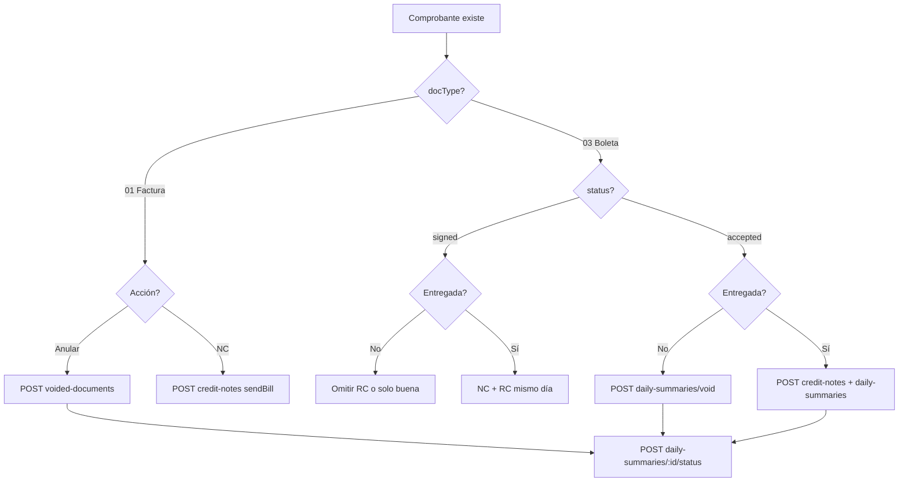

# Guía frontend — facturación SUNAT Perú

Mapeo de pantallas/flujos sobre `mind-billing-api`. Complementa [casos-practicos.md](casos-practicos.md), [proceso-facturacion.md](proceso-facturacion.md) y **[frontend-tipos-api.md](frontend-tipos-api.md)** (tipos TS, relaciones, contrato API).

## Autenticación (todas las rutas)

| Header | Rol |
|--------|-----|
| `X-Api-Key` | Empresa (tenant) |
| `Authorization: Bearer <JWT>` | Usuario |

Los documentos siempre se filtran por `companyId` del API key.

Dev: `mbak_dev00000000000000000000000001`, login `admin` / `admin123`.

---

## Pantallas sugeridas

### 1. Emisión factura

- `POST /v1/invoices`
- Polling: no aplica (`sendBill` síncrono)
- Estados: `accepted` | `rejected` | `failed`

### 2. Emisión boleta

- `POST /v1/boletas`
- Estado resultante: `signed`
- Acción siguiente: incluir en RC del día

### 3. Cerrar RC del día (altas)

- Lista: boletas/NC/ND `signed`, `issueDate` = fecha seleccionada, sin RC previo
- Botón: “Enviar resumen a SUNAT”
- `POST /v1/daily-summaries` body: `{ referenceDate, issueDate }` (default hoy)
- Polling: `POST /v1/daily-summaries/:id/status`
- Éxito: documentos → `accepted`
- **Beta:** si error pero hay `ticket` en respuesta → mostrar “Consultar estado” (no botón “Reenviar RC”)

### 4. Anular boletas (RC void) — no entregadas

**Precondiciones:**

- `docType = 03`, `status = accepted`, `daily_summary_id` not null
- Sin `_rcVoid` en payload

**Flujo:**

1. Confirmar: “No se entregó al cliente”
2. Multi-select (misma `issueDate`)
3. `POST /v1/daily-summaries/void`
4. Polling `/status`
5. Boletas → `voided`

### 5. Nota de crédito boleta — entregada / devolución

1. Confirmar entrega/devolución
2. `POST /v1/credit-notes` — serie `BC01`, `documentoAfectadoId`
3. NC queda `signed` → pendiente RC
4. `POST /v1/daily-summaries` — `referenceDate` = fecha emisión NC
5. Polling hasta NC `accepted`

### 6. Nota de crédito factura

1. Buscar factura `accepted`
2. `POST /v1/credit-notes` — serie `FC01`, `documentoAfectadoId`
3. CDR inmediato en respuesta — **no** pedir RC
4. Factura original sigue `accepted` en listado

### 7. Anular facturas (RA)

- Pantalla separada de boletas void
- Lista: facturas `01` `accepted`, sin `daily_summary_id` (o con RA en curso)
- `POST /v1/voided-documents`:
  ```json
  {
    "documentIds": ["uuid-factura"],
    "referenceDate": "2026-05-24",
    "issueDate": "2026-05-25",
    "motivoBaja": "ERROR EN DATOS"
  }
  ```
- Polling: `POST /v1/daily-summaries/:id/status` (el RA devuelve `dailySummaryId`)
- Éxito: factura → `voided`

**Beta:** si respuesta incluye `ticket` pero error → botón “Consultar estado RA”, no reenviar RA.

---

## Estados de documento (badges UI)

| Estado | Color sugerido | Acciones |
|--------|----------------|----------|
| `signed` | Amarillo | RC; NC (mismo día) |
| `accepted` | Verde | NC; void boleta (si no entregada); RA factura |
| `voided` | Gris | Solo consulta |
| `rejected` / `failed` | Rojo | Reintentar según tipo |

---

## Estados RC/RA (`daily_summaries`)

| Status | UI |
|--------|-----|
| `draft` / `submitted` / `processing` | Spinner + “Consultar estado” |
| `accepted` | Éxito — docs actualizados |
| `rejected` | Error SUNAT — revisar mensaje |
| `failed` | Error técnico — si hay `ticket`, ofrecer “Consultar estado”; si no, reintentar envío |

**Un solo botón polling** para RC y RA: `POST /v1/daily-summaries/:id/status`.

`GET /v1/daily-summaries/:id` — detalle: `summaryType` (`RC`|`RA`), `ticket`, `documentCount`, `errorMessage`.

---

## Pregunta clave en UI

> **¿Se entregó este comprobante al cliente?**

| Respuesta | Flujo |
|-----------|-------|
| No (boleta) | Void si `accepted` + RC previo; omitir RC si solo `signed` |
| Sí (boleta) | NC + RC |
| Factura anular | RA (independiente de “entregada”) |
| Factura devolución | NC factura (sendBill) |

---

## Campos por endpoint

### `POST /v1/credit-notes` / `debit-notes`

| Campo | Requerido | Notas |
|-------|-----------|-------|
| `serie` | Sí | `BC01`/`FC01` (07), `BD01`/`FD01` (08) |
| `documentoAfectadoId` | Sí | UUID boleta/factura |
| `cliente`, `items[]`, `moneda` | Sí | |

### `POST /v1/daily-summaries`

| Campo | Requerido | Notas |
|-------|-----------|-------|
| `referenceDate` | No | Default hoy |
| `issueDate` | No | Default hoy |

### `POST /v1/daily-summaries/void`

| Campo | Requerido | Notas |
|-------|-----------|-------|
| `documentIds` | Sí | UUID[] boletas `accepted` |
| `referenceDate` | No | Validada vs `issueDate` boletas |
| `issueDate` | No | Default hoy |

### `POST /v1/voided-documents`

| Campo | Requerido | Notas |
|-------|-----------|-------|
| `documentIds` | Sí | UUID[] facturas `accepted` |
| `referenceDate` | No | = `issueDate` factura |
| `issueDate` | No | Default hoy |
| `motivoBaja` | No | Default `ERROR EN DATOS` |

---

## Listados recomendados

| Pantalla | Filtros |
|----------|---------|
| Pendientes RC hoy | `signed`, `issueDate=hoy`, sin `daily_summary_id` |
| Boletas anulables | `accepted`, `03`, con RC previo |
| Facturas anulables (RA) | `accepted`, `01`, sin RA en curso |
| NC pendientes RC | `07`/`08`, `signed`, hoy |
| RC/RA historial | `GET /daily-summaries/:id` |
| Detalle doc | `GET /documents/:id` |

---

## UX SUNAT beta (RC/RA)

```
Envío RC/RA
    │
    ├─ Respuesta OK + accepted → éxito
    ├─ Respuesta OK + processing → spinner + "Consultar en 1 min"
    ├─ Error + ticket en body → NO reenviar; botón "Consultar estado"
    └─ Error sin ticket → permitir reenvío
```

Mostrar `dailySummaryId` y `ticket` en pantalla de error para soporte.

---

## Diagrama flujo decisión



---

## Archivos API

- `src/documents/documents.controller.ts`
- `src/documents/documents.service.ts`
- `src/documents/daily-summaries.service.ts`
- `src/documents/voided-documents.service.ts`
