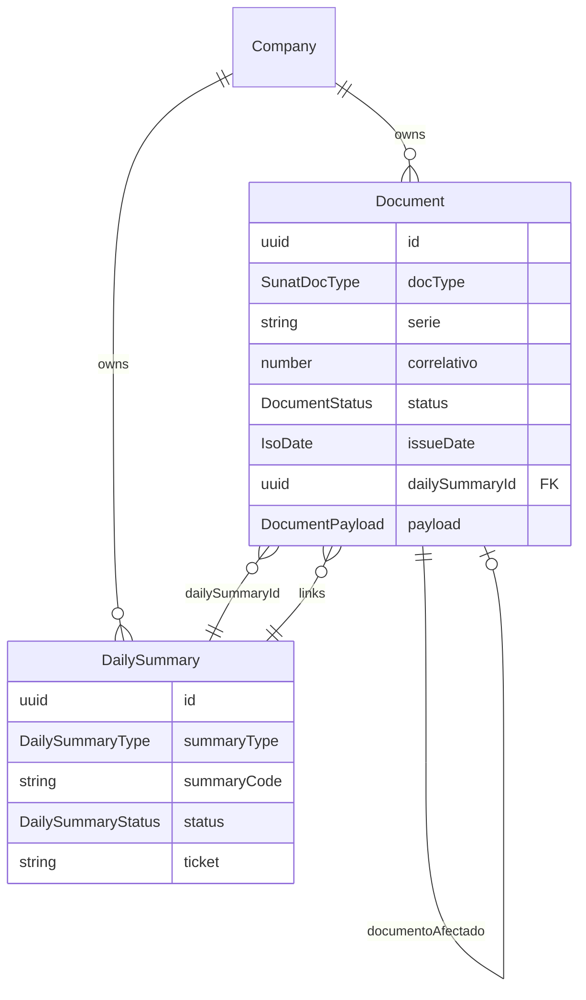

# Frontend — tipos, relaciones y contrato API

Referencia para implementar **TypeScript types**, modelos de dominio y cliente HTTP en el frontend que consume `mind-billing-api`.

Complementa [frontend-guia.md](frontend-guia.md) y [base-de-datos.md](base-de-datos.md).

---

## Estrategia recomendada

```
src/
  api/
    client.ts              # fetch/axios + headers
    endpoints.ts             # rutas
  types/
    enums.ts                 # copiar de aquí
    auth.types.ts
    document.types.ts
    daily-summary.types.ts
    api-requests.types.ts    # bodies POST
    api-responses.types.ts   # respuestas OK
    api-errors.types.ts      # errores Nest
  models/                    # opcional: normalizado para UI
    document.model.ts
    daily-summary.model.ts
  hooks/ | services/         # React Query, etc.
```

**Fuente de verdad backend:** `src/documents/dto/*`, `src/documents/types/document-response.types.ts`, entidades TypeORM.

---

## Enums (copiar tal cual)

```typescript
/** ISO date YYYY-MM-DD */
export type IsoDate = `${number}-${number}-${number}`;

export type SunatEnvironment = 'beta' | 'homologacion' | 'production';

export type SunatDocType = '01' | '03' | '07' | '08';

export type DailySummaryType = 'RC' | 'RA';

export type DocumentStatus =
  | 'draft'
  | 'signed'
  | 'submitted'
  | 'accepted'
  | 'rejected'
  | 'failed'
  | 'observed'
  | 'voided';

export type DailySummaryStatus =
  | 'draft'
  | 'submitted'
  | 'processing'
  | 'accepted'
  | 'rejected'
  | 'failed';
```

---

## Relaciones de dominio (frontend)



### Reglas de relación en UI

| Campo | Tipo FE | Uso |
|-------|---------|-----|
| `Document.dailySummaryId` | `string \| null` | RC/RA que informó o está procesando el doc |
| `Document.payload.documentoAfectado` | objeto embebido | NC/ND → boleta/factura afectada (serie-correlativo) |
| `Document.payload._rcVoid` | opcional | Void RC en curso; ocultar de selección void |
| `DailySummary.summaryType` | `RC` \| `RA` | Misma pantalla polling; distinto copy UI |

**No hay endpoint list documents aún** — hoy el FE obtiene docs por `GET /documents/:id` o guarda IDs tras crear. Backlog: `GET /documents` con filtros.

---

## Tipos compartidos (cliente, ítems)

```typescript
export interface ClienteInput {
  tipoDoc: string;   // catálogo 06: '1' DNI, '6' RUC
  numDoc: string;
  razonSocial: string;
}

export interface ItemInput {
  codigo: string;
  descripcion: string;
  cantidad: number;
  precioUnitario: number;
  igv?: number;
}

export interface DocumentoAfectadoRef {
  docType: SunatDocType;
  serie: string;
  correlativo: number;
}

export interface DocumentTotals {
  subtotal: number;
  igvTotal: number;
  total: number;
}

/** Contenido de documents.payload en GET /documents/:id */
export interface DocumentPayload {
  cliente?: ClienteInput;
  moneda?: string;
  items?: ItemInput[];
  totals?: DocumentTotals;
  tipoOperacion?: string;
  formaPago?: string;
  motivoCodigo?: string;
  motivoDescripcion?: string;
  documentoAfectado?: DocumentoAfectadoRef;
  documentoAfectadoId?: string;
  _rcVoid?: {
    voidSummaryId: string;
    originalDailySummaryId: string | null;
  };
}
```

---

## Auth

### Request

```typescript
export interface LoginRequest {
  username: string;
  password: string;
}
```

### Response `POST /v1/auth/login`

```typescript
export interface LoginResponse {
  accessToken: string;
  tokenType: 'Bearer';
  user: {
    id: string;
    username: string;
    fullName: string | null;
  };
  company: {
    id: string;
    ruc: string;
    businessName: string;
    sunatEnvironment: SunatEnvironment;
  };
}
```

### Response `GET /v1/auth/me`

```typescript
export interface MeResponse {
  user: LoginResponse['user'];
  company: LoginResponse['company'] & {
    tradeName: string | null;
  };
}
```

### Headers en todas las rutas protegidas

```typescript
export interface ApiHeaders {
  'X-Api-Key': string;
  Authorization: `Bearer ${string}`;
}
```

---

## Documentos — requests

```typescript
export interface CreateInvoiceRequest {
  serie: string;
  tipoOperacion: string;  // ej. '0101'
  moneda: string;           // 'PEN'
  cliente: ClienteInput;
  items: ItemInput[];
  formaPago?: string;
}

export interface CreateBoletaRequest {
  serie: string;
  moneda: string;
  cliente: ClienteInput;
  items: ItemInput[];
  tipoOperacion?: string;
  formaPago?: string;
}

export interface CreateNoteRequest {
  serie: string;              // FC01/BC01 o FD01/BD01
  moneda: string;
  documentoAfectadoId: string; // UUID
  cliente: ClienteInput;
  items: ItemInput[];
  motivoCodigo?: string;
  motivoDescripcion?: string;
}
```

---

## Resúmenes — requests

```typescript
export interface CloseDailySummaryRequest {
  /** Fecha emisión docs signed a incluir. Default: hoy */
  referenceDate?: IsoDate;
  /** Fecha envío RC. Default: hoy */
  issueDate?: IsoDate;
}

export interface VoidDailySummaryRequest {
  documentIds: string[];
  /** Fecha emisión original boleta(s). Opcional si coincide en BD */
  referenceDate?: IsoDate;
  /** Fecha envío RC void. Default: hoy */
  issueDate?: IsoDate;
}

export interface VoidedDocumentsRequest {
  documentIds: string[];
  /** Fecha emisión factura(s). Debe = issueDate factura */
  referenceDate?: IsoDate;
  /** Fecha envío RA. Default: hoy */
  issueDate?: IsoDate;
  motivoBaja?: string;
}
```

---

## Documentos — responses

### Boleta `POST /v1/boletas`

```typescript
export interface BoletaCreatedResponse {
  id: string;
  docType: '03';
  serie: string;
  correlativo: number;
  status: 'signed';
  total: string;
  issueDate: string | null;
  message: string;
}
```

### Factura / NC factura (sendBill)

```typescript
export interface SunatBillResult {
  statusCode: string | null;
  description: string | null;
  accepted: boolean;
  errorMessage: string | null;
}

export interface InvoiceCreatedResponse {
  id: string;
  docType: '01';
  serie: string;
  correlativo: number;
  status: DocumentStatus;
  total: string;
  sunat: SunatBillResult;
}

export interface NoteBillResponse extends InvoiceCreatedResponse {
  docType: '07' | '08';
}
```

### NC boleta (sin sendBill)

```typescript
export interface NoteSignedResponse {
  id: string;
  docType: '07' | '08';
  serie: string;
  correlativo: number;
  status: 'signed';
  total: string;
  issueDate: string | null;
  documentoAfectado?: DocumentoAfectadoRef;
  message: string;
}
```

### Detalle `GET /v1/documents/:id`

```typescript
export interface DocumentSunatSummary {
  method: string;
  statusCode: string | null;
  errorMessage: string | null;
  createdAt: string; // ISO datetime JSON
}

export interface DocumentDetail {
  id: string;
  docType: SunatDocType;
  serie: string;
  correlativo: number;
  status: DocumentStatus;
  total: string;
  issueDate: IsoDate | null;
  dailySummaryId: string | null;
  payload: DocumentPayload | null;
  createdAt: string;
  updatedAt: string;
  sunat: DocumentSunatSummary | null;
}

/** Display helper */
export type DocumentKey = `${string}-${number}`; // F001-12
export function documentLabel(d: Pick<DocumentDetail, 'serie' | 'correlativo'>): DocumentKey {
  return `${d.serie}-${d.correlativo}`;
}
```

---

## Daily summary — responses

### `GET /v1/daily-summaries/:id`

```typescript
export interface DailySummaryDetail {
  id: string;
  summaryType: DailySummaryType;
  summaryCode: string;
  referenceDate: IsoDate;
  issueDate: IsoDate;
  correlativo: number;
  status: DailySummaryStatus;
  ticket: string | null;
  statusCode: string | null;
  errorMessage: string | null;
  documentCount: number;
  createdAt: string;
  updatedAt: string;
}
```

### Submit RC / RA / status poll (shape común)

```typescript
export interface SunatSummaryPoll {
  statusCode: string | null;
  description: string | null;
  processing?: boolean;
  accepted?: boolean;
  documentCount?: number;
  voidedCount?: number;
}

export interface DailySummarySubmitResponse {
  id: string;
  summaryType: DailySummaryType;
  summaryCode: string;
  referenceDate?: IsoDate;
  issueDate?: IsoDate;
  correlativo?: number;
  status: DailySummaryStatus;
  ticket: string | null;
  statusCode?: string | null;
  errorMessage?: string | null;
  createdAt?: string;
  updatedAt?: string;
  sunat?: SunatSummaryPoll;
}
```

Endpoints que devuelven esta forma:
- `POST /v1/daily-summaries`
- `POST /v1/daily-summaries/void`
- `POST /v1/voided-documents`
- `POST /v1/daily-summaries/:id/status`

---

## Errores API (Nest BadRequest)

```typescript
export interface ApiErrorBody {
  statusCode: number;
  message: string | ApiFieldError[];
  error?: string;
}

export interface ApiFieldError {
  property: string;
  constraints: Record<string, string>;
}

/** Errores de negocio SUNAT (400 con objeto) */
export interface SunatSubmitError {
  message: string;
  documentId?: string;
  dailySummaryId?: string;
  status: DocumentStatus | DailySummaryStatus;
  ticket?: string | null;
  hint?: string;
  sunat?: {
    statusCode?: string | null;
    description?: string | null;
    accepted?: boolean;
    processing?: boolean;
  };
}
```

En axios/fetch, parsear `error.response.data` como `SunatSubmitError` cuando `statusCode === 400`.

---

## Mapa endpoint → tipos

| Método | Ruta | Request | Response OK |
|--------|------|---------|-------------|
| POST | `/auth/login` | `LoginRequest` | `LoginResponse` |
| GET | `/auth/me` | — | `MeResponse` |
| POST | `/invoices` | `CreateInvoiceRequest` | `InvoiceCreatedResponse` |
| POST | `/boletas` | `CreateBoletaRequest` | `BoletaCreatedResponse` |
| POST | `/credit-notes` | `CreateNoteRequest` | `NoteSignedResponse` \| `NoteBillResponse` |
| POST | `/debit-notes` | `CreateNoteRequest` | `NoteSignedResponse` \| `NoteBillResponse` |
| POST | `/daily-summaries` | `CloseDailySummaryRequest` | `DailySummarySubmitResponse` |
| POST | `/daily-summaries/void` | `VoidDailySummaryRequest` | `DailySummarySubmitResponse` |
| POST | `/voided-documents` | `VoidedDocumentsRequest` | `DailySummarySubmitResponse` |
| GET | `/daily-summaries/:id` | — | `DailySummaryDetail` |
| POST | `/daily-summaries/:id/status` | — | `DailySummarySubmitResponse` |
| GET | `/documents/:id` | — | `DocumentDetail` |
| GET | `/documents/:id/xml` | — | `{ xml: string }` o stream |
| GET | `/documents/:id/cdr` | — | `{ cdr: string }` o stream |

---

## Modelos UI sugeridos (normalizados)

Útil si usas React Query / Zustand y quieres desacoplar de la respuesta cruda:

```typescript
export interface UiDocument {
  id: string;
  label: string;           // F001-12
  docType: SunatDocType;
  docTypeLabel: string;    // Factura, Boleta, NC...
  status: DocumentStatus;
  issueDate: IsoDate | null;
  total: number;
  dailySummaryId: string | null;
  canIncludeInRc: boolean;     // signed + !dailySummaryId
  canVoidBoleta: boolean;      // 03 accepted + dailySummaryId + !_rcVoid
  canCreditNote: boolean;      // signed|accepted
  canVoidFacturaRa: boolean;   // 01 accepted + !dailySummaryId
  payload: DocumentPayload | null;
}

export function toUiDocument(d: DocumentDetail): UiDocument {
  const p = d.payload ?? {};
  return {
    id: d.id,
    label: documentLabel(d),
    docType: d.docType,
    docTypeLabel: DOC_TYPE_LABELS[d.docType],
    status: d.status,
    issueDate: d.issueDate,
    total: parseFloat(d.total),
    dailySummaryId: d.dailySummaryId,
    canIncludeInRc:
      ['03', '07', '08'].includes(d.docType) &&
      d.status === 'signed' &&
      !d.dailySummaryId,
    canVoidBoleta:
      d.docType === '03' &&
      d.status === 'accepted' &&
      !!d.dailySummaryId &&
      !p._rcVoid,
    canCreditNote:
      (d.docType === '03' && ['signed', 'accepted'].includes(d.status)) ||
      (d.docType === '01' && d.status === 'accepted'),
    canVoidFacturaRa:
      d.docType === '01' && d.status === 'accepted' && !d.dailySummaryId,
    payload: d.payload,
  };
}

const DOC_TYPE_LABELS: Record<SunatDocType, string> = {
  '01': 'Factura',
  '03': 'Boleta',
  '07': 'Nota de crédito',
  '08': 'Nota de débito',
};
```

---

## Cliente API (ejemplo mínimo)

```typescript
const BASE = '/v1';

export class BillingApiClient {
  constructor(
    private apiKey: string,
    private getToken: () => string | null,
  ) {}

  private headers(): HeadersInit {
    const token = this.getToken();
    return {
      'Content-Type': 'application/json',
      'X-Api-Key': this.apiKey,
      ...(token ? { Authorization: `Bearer ${token}` } : {}),
    };
  }

  async getDocument(id: string): Promise<DocumentDetail> {
    const res = await fetch(`${BASE}/documents/${id}`, { headers: this.headers() });
    if (!res.ok) throw await res.json();
    return res.json();
  }

  async closeDailySummary(body: CloseDailySummaryRequest = {}): Promise<DailySummarySubmitResponse> {
    const res = await fetch(`${BASE}/daily-summaries`, {
      method: 'POST',
      headers: this.headers(),
      body: JSON.stringify(body),
    });
    if (!res.ok) throw await res.json();
    return res.json();
  }

  async pollDailySummaryStatus(id: string): Promise<DailySummarySubmitResponse> {
    const res = await fetch(`${BASE}/daily-summaries/${id}/status`, {
      method: 'POST',
      headers: this.headers(),
    });
    if (!res.ok) throw await res.json();
    return res.json();
  }
}
```

---

## Series por tipo (seed dev)

```typescript
export const DEV_SERIES: Record<SunatDocType, string[]> = {
  '01': ['F001'],
  '03': ['B001'],
  '07': ['FC01', 'BC01'],
  '08': ['FD01', 'BD01'],
};

/** NC boleta → BC01; NC factura → FC01 */
export function defaultNoteSerie(affectedDocType: '01' | '03', noteType: '07' | '08'): string {
  if (noteType === '07') return affectedDocType === '01' ? 'FC01' : 'BC01';
  return affectedDocType === '01' ? 'FD01' : 'BD01';
}
```

---

## Checklist implementación FE

- [ ] Enums alineados con backend (no inventar estados)
- [ ] `DocumentPayload` tipado para formularios de detalle
- [ ] Discriminar NC boleta (`signed`) vs NC factura (`accepted` + sunat)
- [ ] Una pantalla/componente `DailySummaryStatusPoller` para RC y RA
- [ ] Manejar `SunatSubmitError.ticket` → mostrar botón poll, no reenviar
- [ ] Guards UI desde `UiDocument` (`canVoidBoleta`, etc.)
- [ ] Cuando exista `GET /documents` list, extender tipos con paginación

---

## Archivos backend de referencia

| Frontend type | Backend |
|---------------|---------|
| `CreateInvoiceRequest` | `src/documents/dto/create-invoice.dto.ts` |
| `CreateBoletaRequest` | `src/documents/dto/create-boleta.dto.ts` |
| `CreateNoteRequest` | `src/documents/dto/create-note.dto.ts` |
| `CloseDailySummaryRequest` | `src/documents/dto/close-daily-summary.dto.ts` |
| `VoidDailySummaryRequest` | `src/documents/dto/void-daily-summary.dto.ts` |
| `VoidedDocumentsRequest` | `src/documents/dto/create-voided-documents.dto.ts` |
| `DocumentDetail` | `src/documents/types/document-response.types.ts` + mapper |
| Enums | `src/common/enums/index.ts`, `daily-summary.entity.ts` |
